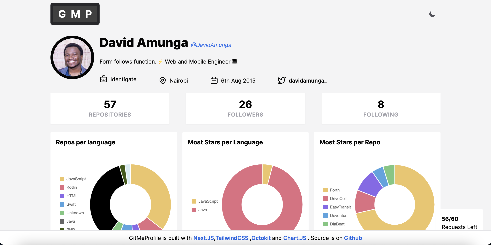

<h1 >GitMeProfile</h1>
<p>
  
  <a href="https://github.com/DavidAmunga/gitmeprofile#readme" target="_blank">
    
  </a>
  <a href="https://github.com/DavidAmunga/gitmeprofile/graphs/commit-activity" target="_blank">
    
  </a>
  <a href="https://github.com/DavidAmunga/gitmeprofile/blob/main/LICENSE" target="_blank">
    
  </a>
  <a href="https://twitter.com/\davidamunga_" target="_blank">
    
  </a>
</p>

> Github Profile Stats Visualizer tool

### 🏠 [Homepage](https://gitmeprofile.vercel.app)

 


## Technologies used
- [NextJS](https://nextjs.com)
- [Octokit](https://octokit.github.io/rest.js/v18)
- [ChartJS](https://www.chartjs.org/)
- [TailwindCSS](https://tailwindcss.com)


## Install

```sh
yarn install
```

## Usage

```sh
yarn run start
```

---

## Future Features to add
- [ ] Commits per Repo Chart
- [ ] Stars per Repo Chart
- [ ] Commit Chart for the past year
- [ ] User Authentication to increase RateLimit requests *(Current is 60/hour )*


## Author

👤 **David Amunga**

* Website: https://davidamunga.com
* Twitter: [@davidamunga_](https://twitter.com/davidamunga_)
* Github: [@DavidAmunga](https://github.com/DavidAmunga)


## How to to Contribute
---
1. Clone repo and create a branch ```$ git checkout https://github.com/DavidAmunga/gitmeprofile -b branch_name.```
2. Make Changes and Test
3. Submit Pull Request with comprehensive description of changes

## Show your support

Give a ⭐️ if this project helped you!

## 📝 License

Copyright © 2021 [David Amunga](https://github.com/DavidAmunga).<br />
This project is [MIT](https://github.com/DavidAmunga/gitmeprofile/blob/master/LICENSE) licensed.

***
_This README was generated with ❤️ by [readme-md-generator](https://github.com/kefranabg/readme-md-generator)_